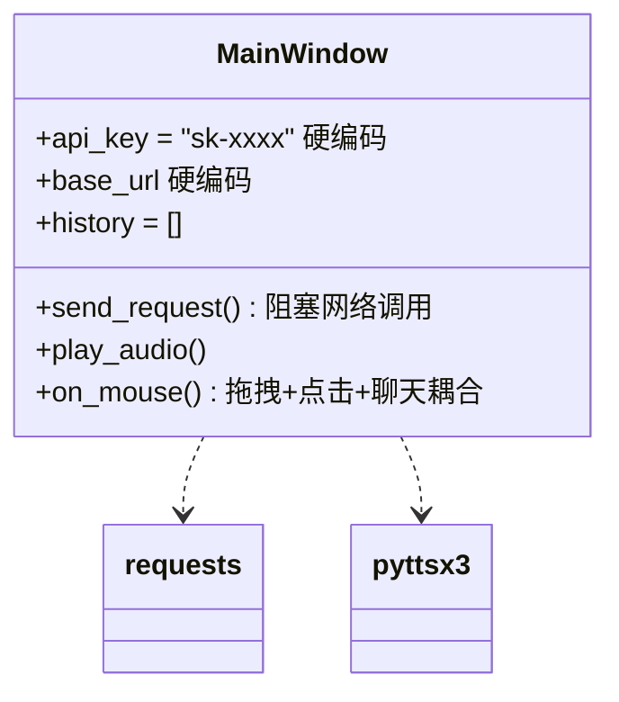
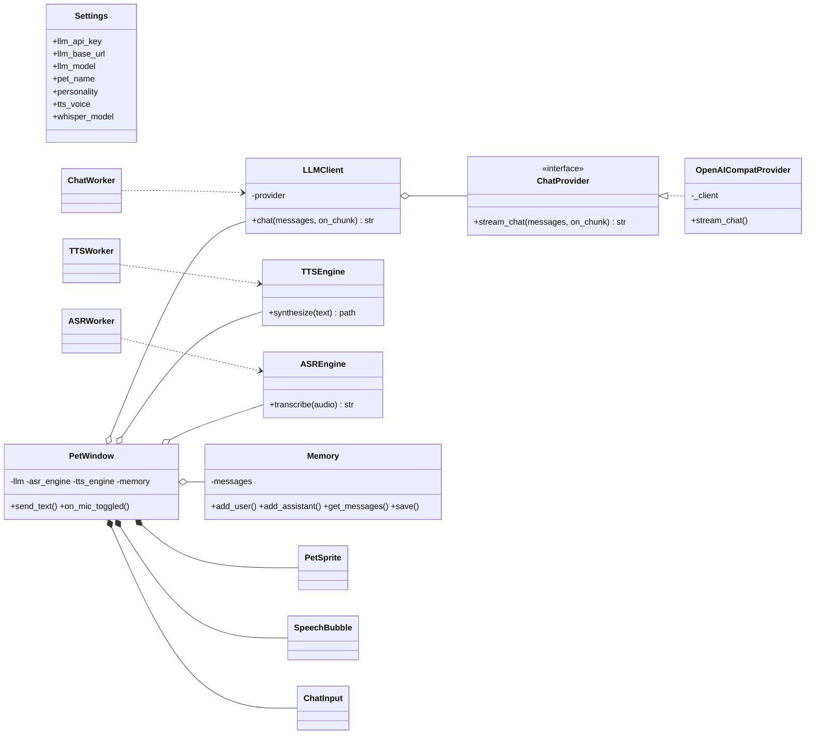
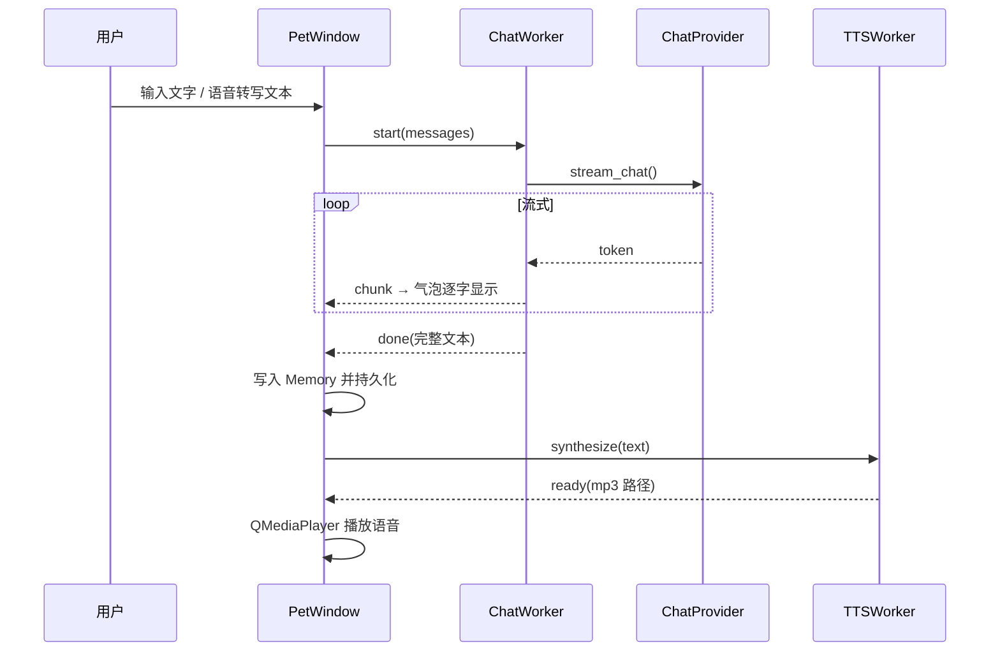

# 设计文档：架构演进与设计模式

> 智能桌面宠物（Intelligent Desk Pet）—— 一个基于 PyQt6 + DeepSeek 的桌面宠物，支持文字与双向语音对话。

## 1. 系统概述

桌面宠物需满足以下核心需求：

1. **桌面呈现**：无边框、置顶、透明窗口，可拖拽，形象可动。
2. **文字对话**：接入 LLM，带人设与跨会话记忆，流式回复。
3. **双向语音**：语音识别（听）+ 语音合成（说）。
4. **可维护性**：配置与逻辑解耦、第三方依赖可替换、可自动化测试。

这些需求天然要求系统具备清晰的模块边界与可扩展结构——这正是本文档讨论「重构」与「设计模式」的出发点。

## 2. 架构演进：重构前后

### 2.1 重构前（初始原型）

第一版原型把所有能力塞进单个 `MainWindow`，存在明显问题：



**主要问题（重构动机）：**

| 问题 | 后果 |
|---|---|
| API 密钥、路径硬编码在逻辑里 | 换环境/换模型要改代码；密钥易泄漏进版本库 |
| 网络/语音/推理全在 UI 线程同步执行 | 界面卡死、无响应 |
| 所有职责耦合在一个类 | 无法单独测试；改一处牵动全局 |
| 直接依赖具体第三方库（requests/pyttsx3） | 换 provider 需改动大量业务代码 |

### 2.2 重构后（分层架构）

重构后，系统按职责划分为「配置 / 引擎（后端）/ 线程 / UI / 记忆」五层，UI 与后端彻底解耦：



### 2.3 一次对话的时序（重构后）



## 3. 设计模式应用

重构过程中明确引入/识别了以下设计模式：

| 模式 | 类型 | 应用位置 | 收益 |
|---|---|---|---|
| **适配器 Adapter** | 结构型 | `LLMClient`→OpenAI SDK、`TTSEngine`→edge-tts、`ASREngine`→faster-whisper | 隔离第三方依赖，统一内部接口 |
| **策略 Strategy** | 行为型 | `ChatProvider` / `OpenAICompatProvider` | 换 DeepSeek/通义/智谱只需新增实现，不改上层 |
| **工厂方法 Factory Method** | 创建型 | `create_chat_provider(settings)` | 创建逻辑集中，调用方不关心具体类 |
| **观察者 Observer** | 行为型 | Qt 信号/槽（`chunk`/`done`/`error`） | 线程与 UI 解耦，UI 永不阻塞 |
| **外观 Facade** | 结构型 | `PetWindow` 对外暴露极简操作 | 隐藏引擎/线程/记忆的复杂性 |

### 3.1 适配器（Adapter）

`ASREngine` / `TTSEngine` / `LLMClient` 分别把 faster-whisper、edge-tts、OpenAI SDK 的原始 API 包装成统一、极简的内部接口，业务层只依赖抽象接口。好处：升级或替换底层库时，改动被限制在适配器内部。

### 3.2 策略 + 工厂方法（Strategy + Factory Method）

LLM 接入被抽象为 `ChatProvider` 接口（策略），`OpenAICompatProvider` 是当前唯一实现；`create_chat_provider()`（工厂）按 `Settings` 决定实例化哪个策略。要接入新的 LLM 服务，只需新增一个 `ChatProvider` 子类，无需改动 `LLMClient` 与 UI 代码——直接印证「可换任意国内 API」。

### 3.3 观察者（Observer）

`ChatWorker`/`ASRWorker`/`TTSWorker` 都是 `QThread`，通过 `pyqtSignal` 向主线程发事件（观察者模式）。这是「UI 永不被网络/录音/推理阻塞」的关键：耗时操作在后台线程执行，主线程只负责响应信号更新界面。

## 4. 重构效果量化

| 指标 | 重构前（原型） | 重构后 |
|---|---|---|
| 源文件数 | 1 | 14（`pet/` 包） |
| 职责划分 | 全部耦合于 MainWindow | 配置/引擎/线程/UI/记忆 五层 |
| 配置硬编码 | 是 | 否（`.env` + `config.json` 分离） |
| UI 阻塞 | 是（同步调用） | 否（QThread + 信号） |
| 可测试性 | 无单测 | 14 个自动化用例 |
| 第三方耦合 | 直接 import 散落 | 适配器/策略隔离 |
| 设计模式 | 0 | 5 种 |

**核心代码规模**（当前）：`pet/` 约 900 行、`tests/` 约 200 行；单文件最大 `window.py` 232 行，其余模块均 <120 行，符合单一职责。

## 5. 目录结构

```
pet/
├── config.py     配置（Settings，隔离 .env 与 config.json）
├── providers.py  LLM 策略 + 工厂（Adapter/Strategy/Factory）
├── llm.py        LLM 门面（Facade）
├── asr.py        语音识别引擎（Adapter）
├── tts.py        语音合成引擎（Adapter）
├── worker.py     后台线程（Observer 的信号）
├── memory.py     会话记忆（持久化）
├── persona.py    人设提示词
├── window.py     主窗口（Facade，编排一切）
├── sprite.py / bubble.py / input_box.py   UI 组件
└── app.py        应用引导
```
